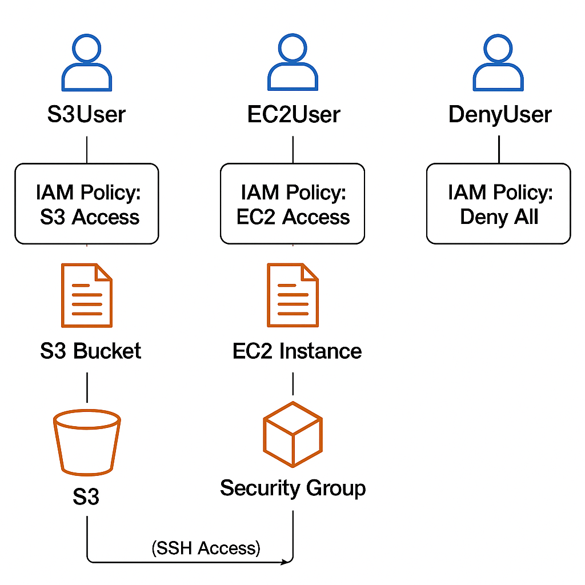

## AWS IAM & Least Privilege Lab

Designed granular IAM policies and role-based access for secure AWS resource isolation.

---

## Table of Contents

- [Overview]
- [Real-World Risk]
- [What I Built]
- [Diagram]
- [Objectives]
- [Steps Performed]
  - [1. IAM User and Policy Setup]
  - [2. Security Group Configuration]
  - [3. EC2 Instance Deployment]
  - [4. Access Testing]
  - [5. Cleanup]
- [Screenshots]
- [Lessons Learned]
- [References]

---

## Overview

This project demonstrates the design and enforcement of AWS Identity and Access Management (IAM) using the principle of least privilege. The lab covers the creation of IAM users, groups, roles, and custom JSON policies, as well as configuring EC2 instance roles and SSH/network access controls. The outcome is a securely segmented AWS environment, with documented evidence for each step.

---

## Real-World Risk

A common risk in cloud environments is granting excessive permissions to users, applications or compute resources. Without granular IAM controls and the principle of least privilege, a compromised set of credentials—such as those belonging to a developer or an EC2 instance—could be exploited to access or manipulate sensitive resources across the AWS account. This increases the likelihood of data breaches, accidental resource deletion and lateral movement by attackers. By tightly scoping IAM policies and roles, the lab demonstrates how to reduce the impact of credential compromise and enforce security boundaries within AWS.

---

## What I Built

- Provisioned AWS IAM users for distinct roles (S3, EC2, and Deny).
- Authored and attached custom JSON policies enforcing least privilege for each user.
- Created IAM groups and an EC2 instance role to manage permissions at scale.
- Configured an EC2 instance with a secure key pair and a restrictive security group.
- Attached the EC2 instance to an IAM role with scoped S3 access for testing.
- Verified user and role permissions in the AWS Console and CLI, capturing evidence of both successful access and denied actions.
- Documented the architecture and testing process with screenshots and a summary diagram.

---

## Diagram

---

## Objectives

- Secure the AWS root account with MFA.
- Create a dedicated admin IAM user.
- Set up IAM users (`S3User`, `EC2User`, `DenyUser`) for resource isolation.
- Create groups and roles as appropriate for permissions management.
- Author and attach least privilege JSON policies.
- Launch an EC2 instance with a restrictive security group and an IAM role for S3.
- Demonstrate permission enforcement through testing and screenshots.

---

## Steps Performed

1. IAM User and Policy Setup
   - Created IAM users: S3User, EC2User & DenyUser.
   - Authored and attached least-privilege policies for each user.

2. Security Group Configuration
   - Created a Security Group allowing SSH only from my IP (Screenshot: ec2-security-group-mypionly.png)
   - Verified and documented security group settings (Screenshot: ec2-security-group-settings.png)
   - Reviewed security group inbound rules for accuracy (Screenshot: ec2-security-group-rules.png)

3. EC2 Instance Deployment
   - Launched an EC2 instance with the configured security group and attached IAM role (Screenshot: ec2-instance-details.png)

4. Access Testing
   - EC2User:
     - Successfully performed EC2 actions (Screenshot: ec2user-ec2-limited-success.png)
     - Denied S3 actions (Screenshot: ec2user-s3-denied.png)
   - S3User:
     - Successfully performed S3 actions (Screenshot: s3user-s3-allowed.png)
     - Denied EC2 actions (Screenshot: s3user-ec2-denied.png)
   - DenyUser:
     - Denied EC2 actions (Screenshot: denyuser-ec2-denied.png)
     - Denied S3 actions (Screenshot: denyuser-s3-denied.png)
   - EC2 Instance Role:
     - Tested S3 access from the EC2 instance (denied as per policy)(Screenshot: ec2-s3-access-denied.png)

5. Cleanup
   - Deleted test users, policies, security groups and EC2 instances to avoid charges and maintain a clean AWS environment.
   
---

## Screenshots

*All relevant screenshots demonstrating each step are included in the screenshots/ folder of this repository.

| #  | File Name                          | What it Shows                                       |
|----|------------------------------------|-----------------------------------------------------|
| 1  | s3user-s3-allowed.png              | S3User successfully accessing S3 (allowed action)   |
| 2  | s3user-ec2-denied.png              | S3User denied when trying to access EC2             |
| 3  | ec2user-ec2-limited-success.png    | EC2User accessing EC2 with limited permissions      |
| 4  | ec2user-s3-denied.png              | EC2User denied when trying to access S3             |
| 5  | ec2-instance-details.png           | EC2 instance details (shows IAM role, security group)|
| 6  | ec2-s3-access-denied.png           | EC2 (with role) denied when attempting S3 action    |
| 7  | ec2-security-group-mypionly.png    | Security group allowing SSH only from my IP         |
| 8  | ec2-security-group-rules.png       | Security group inbound rule details                 |
| 9  | ec2-security-group-settings.png    | General security group configuration                |
| 10 | denyuser-ec2-denied.png            | DenyUser denied when trying to access EC2           |
| 11 | denyuser-s3-denied.png             | DenyUser denied when trying to access S3            |

---

## Lessons Learned

- Planning and enforcing least privilege is critical for AWS security.
- MFA and separation of duties reduce risks on critical accounts.
- Using roles for EC2 access is more secure than access keys.
- Testing each user and role from the console and CLI is essential.
- Documenting every stage (including failures/access denied) proves security posture and provides clarity for auditors or recruiters.

---

## References

- AWS IAM Documentation  
  https://docs.aws.amazon.com/IAM/latest/UserGuide/introduction.html

- AWS EC2 Documentation  
  https://docs.aws.amazon.com/ec2/

- AWS Security Best Practices  
  https://docs.aws.amazon.com/securityhub/latest/userguide/securityhub-standards-fsbp.html

---

Sebastian Silva C. – July, 2025 – Berlin, Germany.
